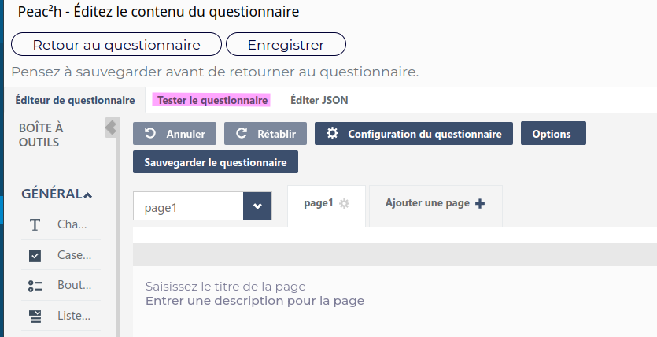
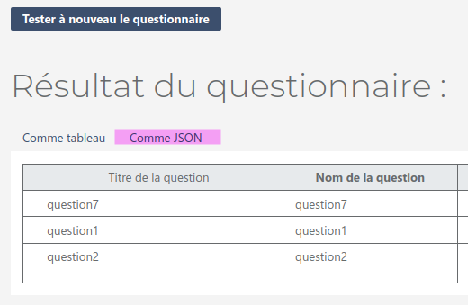
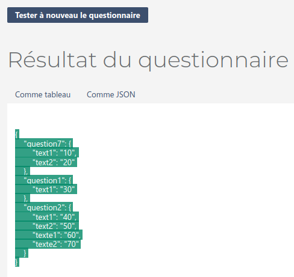
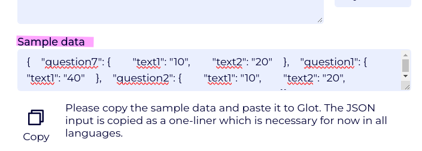
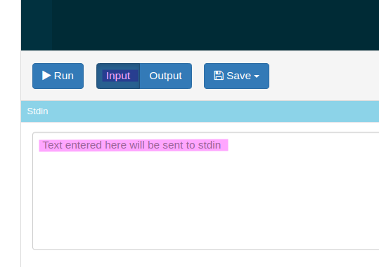

# Peac2h-rating

Rating code for Peac²h using Glot. 


# FR Cotation dans Peac²h 

Ce dépôt contient des exemples de cotations utilisables dans Peac²h.
Les cotations calculées en utilisant Glot. Voilà le fonctionnement 

## Fonctionnement


### Données d'exemple

Vous devez d'abord obtenir des données via votre questionnaire dans Peac²h. Pour cela vous pouvez cliquer sur "Tester de questionnaire" dans l'éditeur de questionnaire :  

 

Une fois que vous avez répondu à toutes les questions, récupérez les résultats en tant que `JSON` :

 

Puis copiez ces données pour les coller dans l'interface de cotation du questionnaire : 

 


Dans la partie "Modifier la cotation" : 

 


> Note : Nous souhaitons automatiser cette étape à l'avenir, pour le moment il faut le faire manuellement.


Les données d'entrées sont un JSON, décrit en une ligne.
Cell-ci doit être copiée dans la partie `input` dans `Glot` comme indiqué ci-dessous. 

 


### Écriture du code 

Vous pouvez maintenant écrire le code de cotation. Pour cela partez d'un exemple qui lit le JSON d'entrée dans la langage de votre choix. 

Voilà les exemples de base : 

#### Python
``` Python 
import json
str = input()
data = json.loads(str)
cotations = {} 
print(json.dumps(cotations))
```

#### Ruby
``` Ruby 
require "json"
inp = $stdin.read
data = JSON.parse(inp)
cotations = {}
## Do the computations here 
puts cotations.to_json
```

#### Javascript 
``` Javascript
// Your cotation code is written before.
function cotation(data){return ""};  
process.stdin.on("readable", () => {
  let chunk = process.stdin.read(); // read input 
  if(chunk){
    let data = JSON.parse(chunk.toString());
    let output = cotation(data);  // you must write a cotation funtion before.
    console.log(output);
  }
});
```

Le résultat des calculs est envoyé sur la sortie standard, via 
des `print` ou `console.log`. Le texte de sortie doit être en JSON et les clés créeront de nouvelles colonnes sur le fichier de sortie à l'export des résultats.


### Copie dans Peac²h 

Une fois le code crée, vous pouvez le copier dans l'interface 
de cotation de votre questionnaire. Puis cliquer sur le bouton "tester" pour demander le résultat du calcul comme sur `Glot` mais avec le moteur de calcul de Peac²h.

Pensez à couvrir tous les cas possibles, avec des résultats vides, partiels. Ajustez les questions obligatoires le cas échéant. 


> TODO: Quand les cotations sont calculées, comment les voir ?


